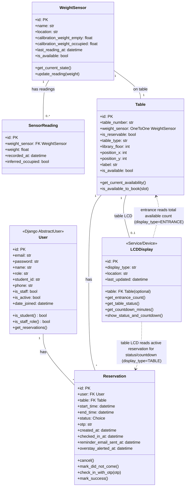

# Library Table Reservation System – Class Diagram

Entrance LCD (available-seat count), reservable vs walk-in tables, table type (e.g. 1-person, 4-person), per-table LCD (status + countdown), OTP keypad check-in, librarian overstay alerts, email reminder before session end, and virtual map for layout and booking.

---

## Mermaid class diagram

---

## Relationship summary

| From         | To             | Relationship | Description                                        |
|-------------|----------------|-------------|----------------------------------------------------|
| User        | Reservation    | 1 : N       | A user has many reservations (students in app logic) |
| Table       | Reservation    | 1 : N       | A table has many reservations (only if is_reservable) |
| Table       | LCDDisplay     | 0..1 : 1    | Reservable table may have one table LCD (status, countdown) |
| Table       | WeightSensor   | 1 : 1       | Each table has one sensor (sensor on table)        |
| WeightSensor| SensorReading  | 1 : N       | Sensor has many readings (for analysis)           |
| LCDDisplay  | Table          | uses        | Entrance LCD reads total available count; table LCD reads that table’s status |
| LCDDisplay  | Reservation    | uses        | Table LCD derives countdown/status from active reservation |

---

## Enumerations / Choices

**Table:**  
- **is_reservable:** true = book in advance, false = walk-in only.  
- **table_type:** e.g. SINGLE (1-person), DOUBLE (2-person), QUAD (4-person).

**LCDDisplay.display_type:** `ENTRANCE` (at library entrance) | `TABLE` (at a reservable table).

**Reservation status:**  
- `PENDING` – created, not yet checked in  
- `SUCCESS` – user checked in with OTP / used table  
- `DID_NOT_COME` – no show  
- `CANCELLED` – cancelled by user or librarian  
- `EXPIRED` – time window passed without check-in  

---

## Behaviour summary

- **Entrance LCD:** Shows total available seats (all tables where is_available = true).  
- **Table LCD (reservable):** Shows status (reserved, available, etc.) and, in last 30 minutes of session, countdown; student sees reminder before session expires.  
- **OTP keypad:** At reservable table, user enters OTP; system verifies and sets checked_in_at (confirms booker is at table).  
- **Librarian:** Gets alert when student sits beyond booking time (overstay); overstay_alerted_at used so alert is sent once.  
- **Email:** Reminder sent to student before session expires; reminder_email_sent_at avoids duplicate emails.  
- **Virtual map:** Uses Table (position_x, position_y, library_floor, is_reservable, is_available). Shows free/occupied and which reservable tables are available to book; student clicks reservable table to create reservation.
