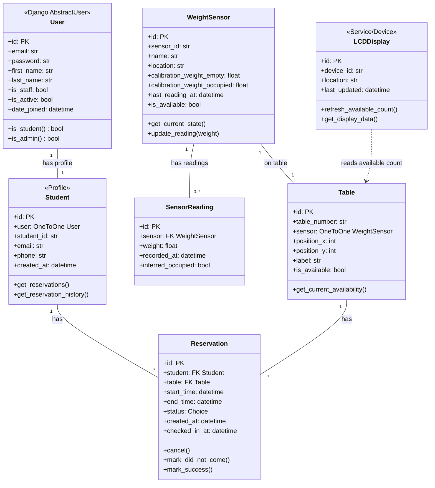
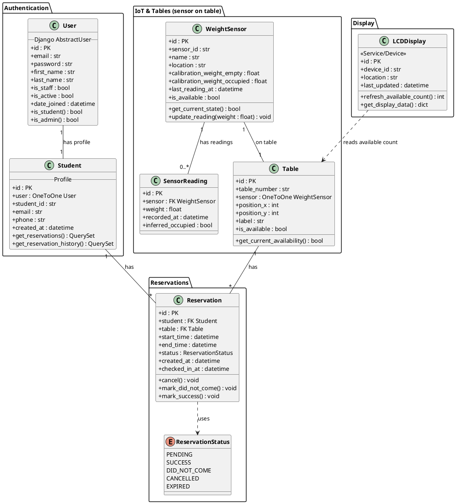

# Library Table Reservation System – Class Diagram

Django-based IoT system: weight sensors on **tables** (detection by table, not seat) → table availability, LCD display, web map & reservations, student registration & history, admin management & analysis. No library zones; each table has one sensor.

---

## Mermaid class diagram

---

## Relationship summary

| From         | To             | Relationship | Description                                        |
|-------------|----------------|-------------|----------------------------------------------------|
| User        | Student        | 1 : 1       | One user account, one student profile              |
| Student     | Reservation    | 1 : N       | A student has many reservations                    |
| Table       | Reservation    | 1 : N       | A table has many reservations (over time)         |
| Table       | WeightSensor   | 1 : 1       | Each table has one sensor (sensor on table)        |
| WeightSensor| SensorReading  | 1 : N       | Sensor has many readings (for analysis)           |
| LCDDisplay  | Table          | uses        | Reads availability to show “tables available”     |

---

## Enumerations / Choices

**Reservation status (Django `TextChoices`):**

- `PENDING` – created, not yet used  
- `SUCCESS` – student checked in / used table  
- `DID_NOT_COME` – no show  
- `CANCELLED` – cancelled by student or admin  
- `EXPIRED` – time window passed without check-in  

---

## Django app suggestion

- **`accounts`** – `User`, `Student`  
- **`tables`** – `Table`, `WeightSensor`, `SensorReading`  
- **`reservations`** – `Reservation`  
- **`devices`** (optional) – `LCDDisplay` if you store device config in DB  

---

## PlantUML (for draw.io / PlantUML tools)

Save as `CLASS_DIAGRAM.puml` and open in [PlantUML](https://www.plantuml.com/plantuml) or import into draw.io.

