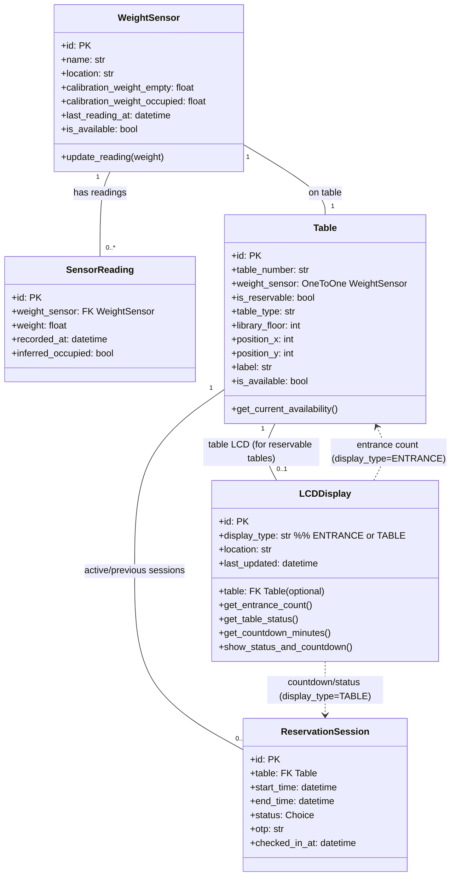

# IoT-Only View – Class Diagram

This diagram shows only the entities/classes involved in **IoT monitoring and per-table display**:
- weight sensors attached to tables
- sensor readings for history/analytics
- tables that expose occupancy/free state
- LCD displays (entrance + per-table LCD)
- reservation session data used by the per-table LCD countdown and OTP check-in

--- 

## Mermaid class diagram

