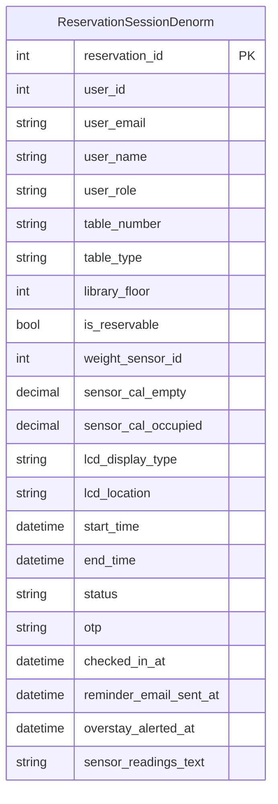
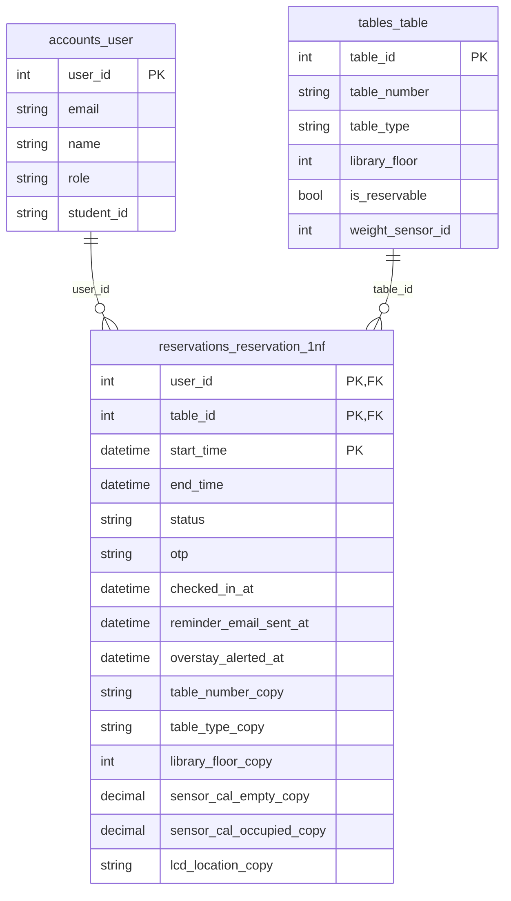
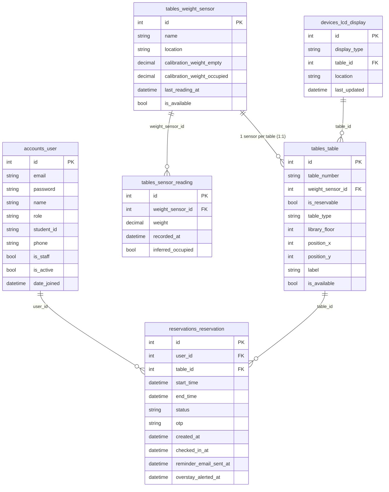

# Database Diagrams (Normalization Comparison)

This section provides three database schemas to help explain normalization for the Library Table Reservation System described in the ERD.

1. **Unnormalized / Denormalized (0NF-ish)**: a single table stores user + table + sensor + LCD + session data, including a non-atomic repeating group.
2. **1NF (atomic fields, but redundant + partial dependencies remain)**: tables are separated, but some non-key attributes still depend only on part of a composite key.
3. **2NF (normalized)**: redundancy is removed by separating sensor/table/LCD entities; reservation keeps only what depends on the whole key.

The final schema (current ERD) corresponds to **2NF and also 3NF** in practical terms (because relationships are decomposed by entity responsibilities and reservation stores only keys + session attributes).

---

## 1) Unnormalized / Denormalized Diagram

Why it is unnormalized:
- user/table/sensor/LCD information is duplicated inside one record
- `sensor_readings_text` represents repeating data in one field (violates 1NF)

---

## 2) 1NF Diagram (atomic, but partial dependencies exist)

Why it is 1NF but not 2NF:
- All columns are atomic (no repeating groups).
- However, in `reservations_reservation_1nf`, attributes like `table_type_copy` depend only on `table_id` (a subset of the composite key), not the full key (`user_id, table_id, start_time`).
- Therefore, it violates the intent of 2NF.

---

## 3) 2NF Diagram (normalized, matches the ERD)

Why this is 2NF (and also 3NF):
- Reservation stores only keys (`user_id`, `table_id`) and reservation/session attributes (time, status, otp, reminders).
- Table/type/floor/capacity live in `tables_table` and calibration lives in `tables_weight_sensor`.
- LCD behaviour is represented by `devices_lcd_display` (entrance vs table) and references `tables_table` when needed.

---

## Which normalization is your current ERD?

Your current ERD schema is designed to satisfy **at least 2NF** (and in typical database practice also 3NF):
- There are separate tables for different responsibilities (User, Table, Sensor, SensorReading, LCD, Reservation).
- There is no repeating group stored as text/array inside a row.
- Non-key attributes depend on their appropriate entity keys rather than being duplicated inside the reservation session row.

