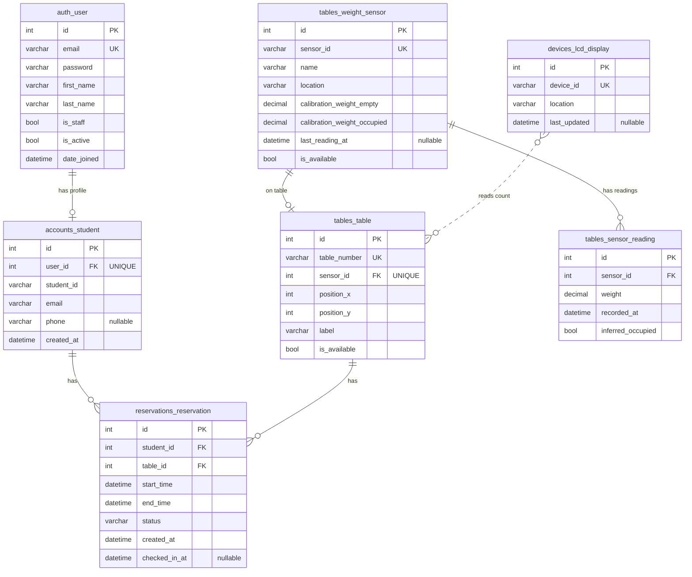
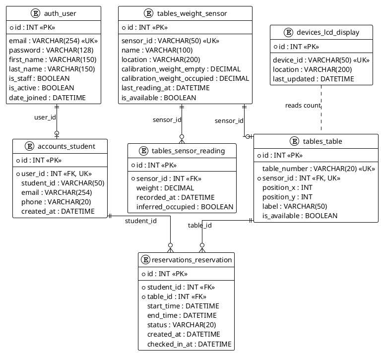

# Library Table Reservation System – ERD

Entity-Relationship Diagram for the Django database schema. Tables follow Django naming: `app_label_modelname` (e.g. `accounts_student`, `tables_table`).

---

## Mermaid ER diagram

---

## Table definitions (Django-style)

### 1. `auth_user` (Django built-in or custom User)

| Column       | Type        | Constraints   | Notes                    |
|-------------|-------------|--------------|--------------------------|
| id          | INT         | PK, AUTO     |                          |
| email       | VARCHAR(254)| UNIQUE, NOT NULL | Login identifier    |
| password    | VARCHAR(128)| NOT NULL    | Hashed                   |
| first_name  | VARCHAR(150)|              |                          |
| last_name   | VARCHAR(150)|              |                          |
| is_staff    | BOOLEAN     | DEFAULT FALSE| Admin access             |
| is_active   | BOOLEAN     | DEFAULT TRUE |                          |
| date_joined | DATETIME    | NOT NULL     |                          |

*If using custom user: use `accounts_user` (or your app name) with same shape.*

---

### 2. `accounts_student`

| Column     | Type         | Constraints        | Notes                |
|------------|--------------|--------------------|----------------------|
| id         | INT          | PK, AUTO           |                      |
| user_id    | INT          | FK → auth_user.id, UNIQUE, NOT NULL | One profile per user |
| student_id | VARCHAR(50)  | NOT NULL           | e.g. matric number   |
| email      | VARCHAR(254) |                    | Optional duplicate   |
| phone      | VARCHAR(20)  | NULL               |                      |
| created_at | DATETIME     | NOT NULL, auto_now_added |              |

---

### 3. `tables_weight_sensor`

| Column                      | Type         | Constraints     | Notes                    |
|----------------------------|--------------|-----------------|--------------------------|
| id                         | INT          | PK, AUTO        |                          |
| sensor_id                  | VARCHAR(50)  | UNIQUE, NOT NULL| Device identifier from IoT |
| name                       | VARCHAR(100) |                 |                          |
| location                   | VARCHAR(200) |                 |                          |
| calibration_weight_empty   | DECIMAL(10,4)|                 | Weight = “table free”    |
| calibration_weight_occupied| DECIMAL(10,4)|                 | Weight = “occupied”      |
| last_reading_at             | DATETIME     | NULL            | Last update from device  |
| is_available                | BOOLEAN      | DEFAULT TRUE    | Derived from weight     |

---

### 4. `tables_sensor_reading`

| Column           | Type         | Constraints     | Notes (history for analytics) |
|------------------|--------------|-----------------|--------------------------------|
| id               | INT          | PK, AUTO        |                                |
| sensor_id        | INT          | FK → tables_weight_sensor.id, NOT NULL |     |
| weight           | DECIMAL(10,4)| NOT NULL        |                                |
| recorded_at      | DATETIME     | NOT NULL        |                                |
| inferred_occupied| BOOLEAN      | NOT NULL        | From calibration thresholds   |

*Index on (sensor_id, recorded_at) for time-range and analytics queries.*

---

### 5. `tables_table`

| Column        | Type         | Constraints      | Notes                    |
|---------------|--------------|------------------|--------------------------|
| id            | INT          | PK, AUTO         |                          |
| table_number  | VARCHAR(20)  | UNIQUE, NOT NULL | e.g. "T01", "A-1"        |
| sensor_id     | INT          | FK → tables_weight_sensor.id, UNIQUE, NOT NULL | One sensor per table |
| position_x    | INT          | NOT NULL         | For library map layout   |
| position_y    | INT          | NOT NULL         | For library map layout   |
| label         | VARCHAR(50)  |                  | Display label            |
| is_available  | BOOLEAN      | DEFAULT TRUE     | Synced from sensor       |

---

### 6. `reservations_reservation`

| Column        | Type         | Constraints     | Notes                          |
|---------------|--------------|-----------------|--------------------------------|
| id            | INT          | PK, AUTO        |                                |
| student_id    | INT          | FK → accounts_student.id, NOT NULL |                    |
| table_id      | INT          | FK → tables_table.id, NOT NULL |                        |
| start_time    | DATETIME     | NOT NULL        |                                |
| end_time      | DATETIME     | NOT NULL        |                                |
| status        | VARCHAR(20)  | NOT NULL        | PENDING, SUCCESS, DID_NOT_COME, CANCELLED, EXPIRED |
| created_at    | DATETIME     | NOT NULL        | When reservation was made      |
| checked_in_at | DATETIME     | NULL            | When student checked in (if any)|

*Indexes: (student_id, created_at) for “my reservations”; (table_id, start_time, end_time) for availability checks.*

---

### 7. `devices_lcd_display`

| Column       | Type         | Constraints | Notes                    |
|--------------|--------------|-------------|--------------------------|
| id           | INT          | PK, AUTO    |                          |
| device_id    | VARCHAR(50)  | UNIQUE      | Physical LCD identifier  |
| location     | VARCHAR(200) |             | Where the display is     |
| last_updated | DATETIME     | NULL        | Last time count refreshed|

---

## Relationship summary (cardinality)

| Parent table           | Child table               | Relationship | FK column    |
|------------------------|---------------------------|-------------|-------------|
| auth_user              | accounts_student           | 1 : 1       | student.user_id |
| accounts_student       | reservations_reservation   | 1 : N       | reservation.student_id |
| tables_table           | reservations_reservation   | 1 : N       | reservation.table_id |
| tables_weight_sensor   | tables_table               | 1 : 1       | table.sensor_id |
| tables_weight_sensor   | tables_sensor_reading      | 1 : N       | sensor_reading.sensor_id |
| devices_lcd_display    | —                          | reads       | No FK; queries tables_table |

---

## How it fits your project

- **IoT:** `tables_weight_sensor` + `tables_sensor_reading` store device id, calibration, and history; backend updates `last_reading_at` and `is_available` (and optionally appends a row to `tables_sensor_reading`).
- **Map & reservation:** `tables_table` has `position_x`, `position_y`, `table_number`, `label`, `is_available` for the web map and availability; `reservations_reservation` links students to tables and time slots.
- **Students:** `auth_user` + `accounts_student` support registration (email) and profile; students see history via `reservations_reservation` filtered by `student_id`.
- **Admin:** Same tables support “all bookings”, “student list”, and analytics (e.g. popular table, busy hour/day) via aggregates on `reservations_reservation` and optionally `tables_sensor_reading`.
- **LCD:** Application or device service reads from `tables_table` (e.g. `COUNT(*) WHERE is_available = TRUE`) and optionally updates `devices_lcd_display.last_updated`.

This ERD is the database view of the system described in `CLASS_DIAGRAM.md`.

---

## PlantUML ERD (optional export)

Copy the block below into [PlantUML](https://www.plantuml.com/plantuml) or save as `ERD.puml` for PNG/SVG export.

