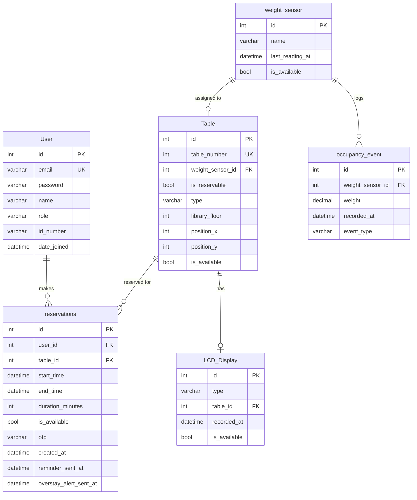
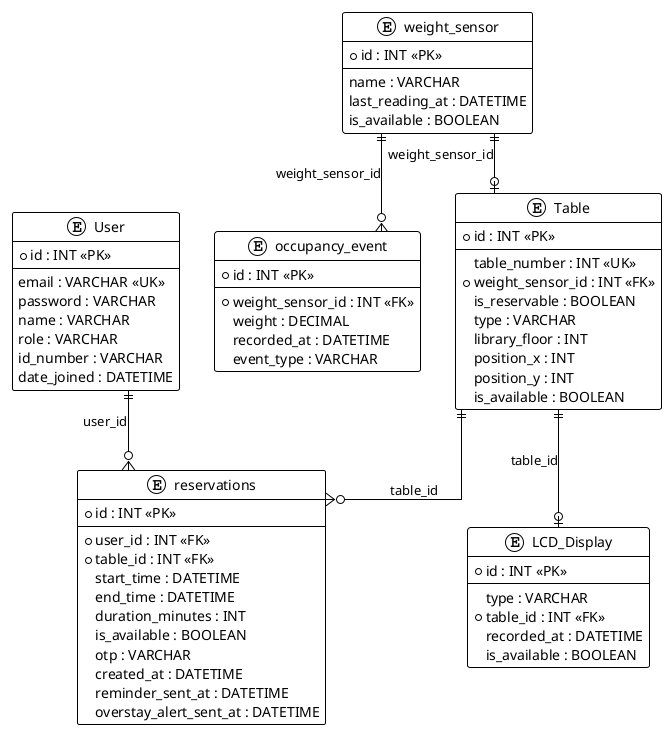

# Library Table Reservation System – ERD

System features: **entrance LCD** (available-seat count), **reservable vs walk-in tables**, **table type** (e.g. 1-person, 4-person), **per-table LCD** on reservable tables (status + countdown), **OTP keypad check-in**, **librarian overstay alerts**, **email reminder** before session expiry, and **virtual map** for layout and booking.

Reservation model (Option 2): **Book-now only**. Students can book a reservable table only when they intend to use it immediately; they choose a **duration** (e.g. 60 minutes). The system sets `start_time = now()` and computes `end_time = start_time + duration_minutes`.

---

## Mermaid ER diagram

---

## Table definitions

### 1. `User`

| Column      | Type     | Constraints | Notes |
|------------|----------|------------|------|
| id         | INT      | PK         |      |
| email      | VARCHAR  | UK         |      |
| password   | VARCHAR  |            |      |
| name       | VARCHAR  |            |      |
| role       | VARCHAR  |            |      |
| id_number  | VARCHAR  |            |      |
| date_joined| DATETIME |            |      |

---

### 2. `weight_sensor`

| Column          | Type     | Constraints | Notes |
|----------------|----------|------------|------|
| id             | INT      | PK         |      |
| name           | VARCHAR  |            |      |
| last_reading_at| DATETIME |            |      |
| is_available   | BOOLEAN  |            |      |

---

### 3. `Table`

| Column           | Type     | Constraints | Notes |
|------------------|----------|------------|------|
| id               | INT      | PK         |      |
| table_number     | INT      | UK         |      |
| weight_sensor_id | INT      | FK         |      |
| is_reservable    | BOOLEAN  |            |      |
| type             | VARCHAR  |            |      |
| library_floor    | INT      |            |      |
| position_x       | INT      |            |      |
| position_y       | INT      |            |      |
| is_available     | BOOLEAN  |            |      |

---

### 4. `LCD_Display`

| Column       | Type     | Constraints | Notes |
|-------------|----------|------------|------|
| id          | INT      | PK         |      |
| type        | VARCHAR  |            |      |
| table_id    | INT      | FK         |      |
| recorded_at | DATETIME |            |      |
| is_available| BOOLEAN  |            |      |

---

### 5. `occupancy_event`

| Column           | Type     | Constraints | Notes |
|------------------|----------|------------|------|
| id               | INT      | PK         |      |
| weight_sensor_id | INT      | FK         |      |
| weight           | DECIMAL  |            |      |
| recorded_at      | DATETIME |            |      |
| event_type       | VARCHAR  |            |      |

---

### 6. `reservations`

| Column                 | Type     | Constraints | Notes |
|------------------------|----------|------------|------|
| id                     | INT      | PK         |      |
| user_id                | INT      | FK         |      |
| table_id               | INT      | FK         |      |
| start_time             | DATETIME |            |      |
| end_time               | DATETIME |            |      |
| duration_minutes       | INT      |            |      |
| is_available           | BOOLEAN  |            |      |
| otp                    | VARCHAR  |            |      |
| created_at             | DATETIME |            |      |
| reminder_sent_at       | DATETIME |            |      |
| overstay_alert_sent_at | DATETIME |            |      |

---

## Relationship summary (cardinality)

| Parent table           | Child table               | Relationship | FK column    |
|------------------------|---------------------------|-------------|-------------|
| User                   | reservations              | 1 : N       | reservations.user_id |
| Table                  | reservations              | 1 : N       | reservations.table_id |
| Table                  | LCD_Display               | 1 : 0..1    | LCD_Display.table_id |
| weight_sensor          | Table                     | 1 : 1       | Table.weight_sensor_id |
| weight_sensor          | occupancy_event           | 1 : N       | occupancy_event.weight_sensor_id |

---

## How it fits your project

- **Entrance LCD:** Displays total available seats (count from `Table` where `is_available = true`). Use `LCD_Display` rows with `type = ENTRANCE` (if you model it that way) or reuse the same table with a NULL `table_id`.
- **Reservable vs walk-in:** `Table.is_reservable` controls whether a table can be reserved. `Table.type` stores the table type/capacity label.
- **Table LCD:** A reservable table can have one `LCD_Display` row linked by `LCD_Display.table_id`.
- **OTP keypad:** OTP is stored in `reservations.otp`.
- **Email reminder / Overstay alerts:** Tracked by `reservations.reminder_sent_at` and `reservations.overstay_alert_sent_at`.
- **Virtual map:** Renders layout from `Table.position_x`, `Table.position_y`, `Table.library_floor`, and shows availability via `Table.is_available`. Sensor history is stored in `occupancy_event`.

---

## Enumerations / Choices

**LCD_Display type:** e.g. `ENTRANCE` | `TABLE`

**Table type:** e.g. `SINGLE` (1-person), `DOUBLE` (2-person), `QUAD` (4-person)

---

*End of ERD. See CLASS_DIAGRAM.md for the corresponding class diagram.*

---

## PlantUML ERD (optional export)

Copy the block below into [PlantUML](https://www.plantuml.com/plantuml) or save as `ERD.puml` for PNG/SVG export.

