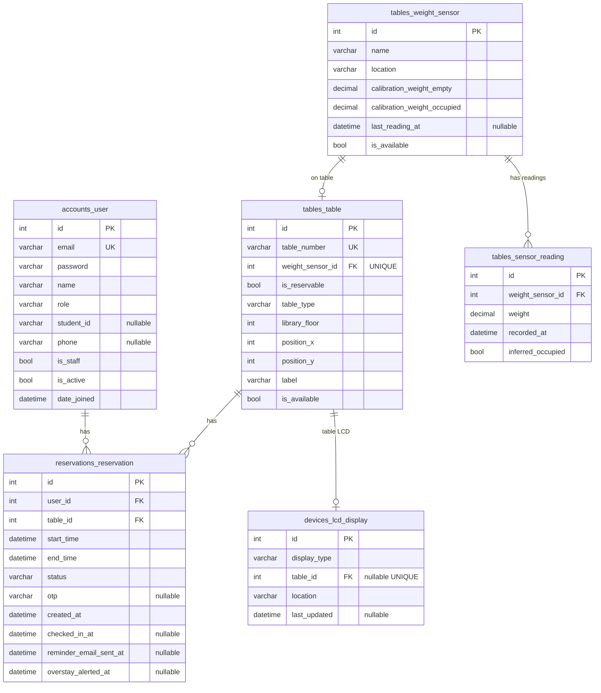
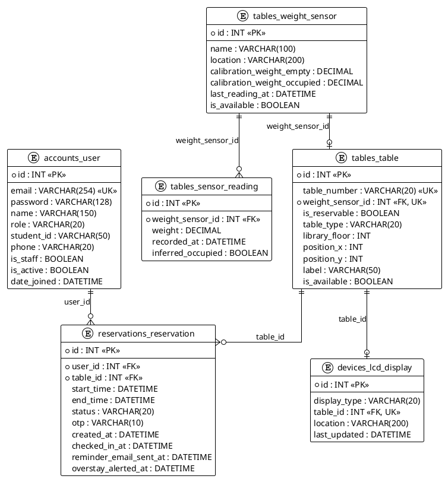

# Library Table Reservation System – ERD

System features: **entrance LCD** (available-seat count), **reservable vs walk-in tables**, **table type** (e.g. 1-person, 4-person), **per-table LCD** on reservable tables (status + countdown), **OTP keypad check-in**, **librarian overstay alerts**, **email reminder** before session expiry, and **virtual map** for layout and booking.

---

## Mermaid ER diagram

---

## Table definitions (Django-style)

### 1. `accounts_user` (single auth table with role)

| Column       | Type         | Constraints     | Notes                                        |
|-------------|--------------|-----------------|----------------------------------------------|
| id          | INT          | PK, AUTO        |                                              |
| email       | VARCHAR(254) | UNIQUE, NOT NULL| Login identifier                             |
| password    | VARCHAR(128) | NOT NULL        | Hashed                                       |
| name        | VARCHAR(150) |                 | Full name                                    |
| role        | VARCHAR(20)  | NOT NULL        | STUDENT, STAFF, ADMIN (librarian = staff/admin) |
| student_id  | VARCHAR(50)  | NULL, UNIQUE    | e.g. matric number; only for role=STUDENT   |
| phone       | VARCHAR(20)  | NULL            |                                              |
| is_staff    | BOOLEAN      | DEFAULT FALSE   | Django admin site access                     |
| is_active   | BOOLEAN      | DEFAULT TRUE    |                                              |
| date_joined | DATETIME     | NOT NULL        |                                              |

*Students make reservations; librarians (staff/admin) manage bookings and receive overstay alerts.*

---

### 2. `tables_weight_sensor`

| Column                      | Type         | Constraints     | Notes                    |
|----------------------------|--------------|-----------------|--------------------------|
| id                         | INT          | PK, AUTO        | Use as sensor identifier |
| name                       | VARCHAR(100) |                 |                          |
| location                   | VARCHAR(200) |                 |                          |
| calibration_weight_empty   | DECIMAL(10,4)|                 | Weight = “table free”    |
| calibration_weight_occupied| DECIMAL(10,4)|                 | Weight = “occupied”     |
| last_reading_at            | DATETIME     | NULL            | Last update from device  |
| is_available               | BOOLEAN      | DEFAULT TRUE    | Derived from weight      |

---

### 3. `tables_sensor_reading`

| Column            | Type         | Constraints     | Notes (history for analytics) |
|-------------------|--------------|-----------------|--------------------------------|
| id                | INT          | PK, AUTO        |                                |
| weight_sensor_id  | INT          | FK → tables_weight_sensor.id, NOT NULL |     |
| weight            | DECIMAL(10,4)| NOT NULL        |                                |
| recorded_at       | DATETIME     | NOT NULL        |                                |
| inferred_occupied| BOOLEAN      | NOT NULL        | From calibration thresholds   |

*Index on (weight_sensor_id, recorded_at) for time-range and analytics queries.*

---

### 4. `tables_table`

| Column           | Type         | Constraints      | Notes                                                                 |
|------------------|--------------|-------------------|-----------------------------------------------------------------------|
| id               | INT          | PK, AUTO         |                                                                       |
| table_number     | VARCHAR(20)  | UNIQUE, NOT NULL | e.g. "T01", "A-1"                                                     |
| weight_sensor_id | INT          | FK → tables_weight_sensor.id, UNIQUE, NOT NULL | One sensor per table                          |
| is_reservable    | BOOLEAN      | NOT NULL         | true = book in advance; false = walk-in only (occupancy only)        |
| table_type       | VARCHAR(20)  | NOT NULL         | Capacity/category: SINGLE (1), DOUBLE (2), QUAD (4), etc.            |
| library_floor    | INT          | NOT NULL         | Floor number (1, 2, …)                                                 |
| position_x       | INT          | NOT NULL         | For virtual map layout                                                |
| position_y       | INT          | NOT NULL         | For virtual map layout                                                |
| label            | VARCHAR(50)  |                  | Display label                                                         |
| is_available     | BOOLEAN      | DEFAULT TRUE     | Synced from sensor (free vs occupied)                                |

*Only rows with is_reservable = true can have reservations. table_type indicates capacity (1-person, 4-person, etc.). Virtual map shows all tables (free/occupied) and which reservable ones are available to book.*

---

### 5. `reservations_reservation`

| Column                 | Type         | Constraints     | Notes                                                                 |
|------------------------|--------------|-----------------|-----------------------------------------------------------------------|
| id                     | INT          | PK, AUTO        |                                                                       |
| user_id                | INT          | FK → accounts_user.id, NOT NULL | Student who made reservation                              |
| table_id               | INT          | FK → tables_table.id, NOT NULL | Must reference a table with is_reservable = true              |
| start_time             | DATETIME     | NOT NULL        | Session start                                                         |
| end_time               | DATETIME     | NOT NULL        | Session end                                                           |
| status                 | VARCHAR(20)  | NOT NULL        | PENDING, SUCCESS, DID_NOT_COME, CANCELLED, EXPIRED                    |
| otp                    | VARCHAR(10)  | NULL            | One-time code for keypad check-in at table; verify booker identity    |
| created_at             | DATETIME     | NOT NULL        | When reservation was made                                             |
| checked_in_at          | DATETIME     | NULL            | When user entered correct OTP at table keypad                         |
| reminder_email_sent_at | DATETIME     | NULL            | When “session ending soon” email was sent (e.g. 15 min before end)   |
| overstay_alerted_at    | DATETIME     | NULL            | When librarian was alerted that student exceeded booking time         |

*Indexes: (user_id, created_at) for “my reservations”; (table_id, start_time, end_time) for availability and overstay checks. OTP is entered on numerical keypad at the reservable table to confirm the person at the table is the one who booked.*

---

### 6. `devices_lcd_display`

| Column        | Type         | Constraints     | Notes                                                                 |
|---------------|--------------|-----------------|-----------------------------------------------------------------------|
| id            | INT          | PK, AUTO        |                                                                       |
| display_type  | VARCHAR(20)  | NOT NULL        | ENTRANCE = at library entrance (shows total available seats); TABLE = at a reservable table |
| table_id      | INT          | FK → tables_table.id, NULL, UNIQUE | NULL for ENTRANCE; set for TABLE (one LCD per reservable table)   |
| location      | VARCHAR(200) |                 | e.g. "Library entrance", "Table T01"                                   |
| last_updated  | DATETIME     | NULL            | Last time display content was refreshed                              |

*ENTRANCE: one (or more) LCD at library entrance showing available-seat count. TABLE: each reservable table has one LCD showing status (reserved, available, etc.) and, in the last 30 minutes of a session, a countdown; table_id links to that table.*

---

## Relationship summary (cardinality)

| Parent table           | Child table               | Relationship | FK column    |
|------------------------|---------------------------|-------------|-------------|
| accounts_user          | reservations_reservation  | 1 : N       | reservation.user_id |
| tables_table           | reservations_reservation  | 1 : N       | reservation.table_id |
| tables_table           | devices_lcd_display       | 1 : 0..1    | lcd.table_id (only when display_type=TABLE) |
| tables_weight_sensor   | tables_table              | 1 : 1       | table.weight_sensor_id |
| tables_weight_sensor   | tables_sensor_reading     | 1 : N       | sensor_reading.weight_sensor_id |

---

## How it fits your project

- **Entrance LCD:** Displays total available seats (count from tables_table where is_available = true). Use devices_lcd_display with display_type = ENTRANCE, table_id = NULL.
- **Reservable vs walk-in:** tables_table.is_reservable: true = can be booked in advance; false = walk-in only (sensor shows free/occupied only). table_type = capacity (SINGLE, DOUBLE, QUAD, etc.).
- **Table LCD:** Each reservable table has one LCD (devices_lcd_display with display_type = TABLE and table_id = that table). Shows status (reserved, available, etc.) and, in the last 30 minutes of a session, a countdown. Data comes from reservation + table.
- **OTP keypad:** At reservable table, student enters OTP (stored in reservations_reservation.otp). Backend verifies OTP and table_id, then sets checked_in_at. Ensures the person at the table is the one who booked.
- **Overstay alert:** When current time > reservation.end_time and checked_in_at is set, alert librarian; set overstay_alerted_at so alert is sent once per reservation.
- **Email reminder:** Before session expires (e.g. 15 min), send email to user; set reminder_email_sent_at to avoid duplicate emails.
- **Virtual map:** Renders layout from tables_table (position_x, position_y, library_floor). Shows free vs occupied (is_available), and for reservable tables whether they are available to book (no conflicting reservation). Student clicks a reservable table to create a reservation.

---

## Enumerations / Choices

**Table display_type:** `ENTRANCE` | `TABLE`

**Table table_type (capacity):** e.g. `SINGLE` (1-person), `DOUBLE` (2-person), `QUAD` (4-person)

**Reservation status:** `PENDING` | `SUCCESS` | `DID_NOT_COME` | `CANCELLED` | `EXPIRED`

---

*End of ERD. See CLASS_DIAGRAM.md for the corresponding class diagram.*

---

## PlantUML ERD (optional export)

Copy the block below into [PlantUML](https://www.plantuml.com/plantuml) or save as `ERD.puml` for PNG/SVG export.

