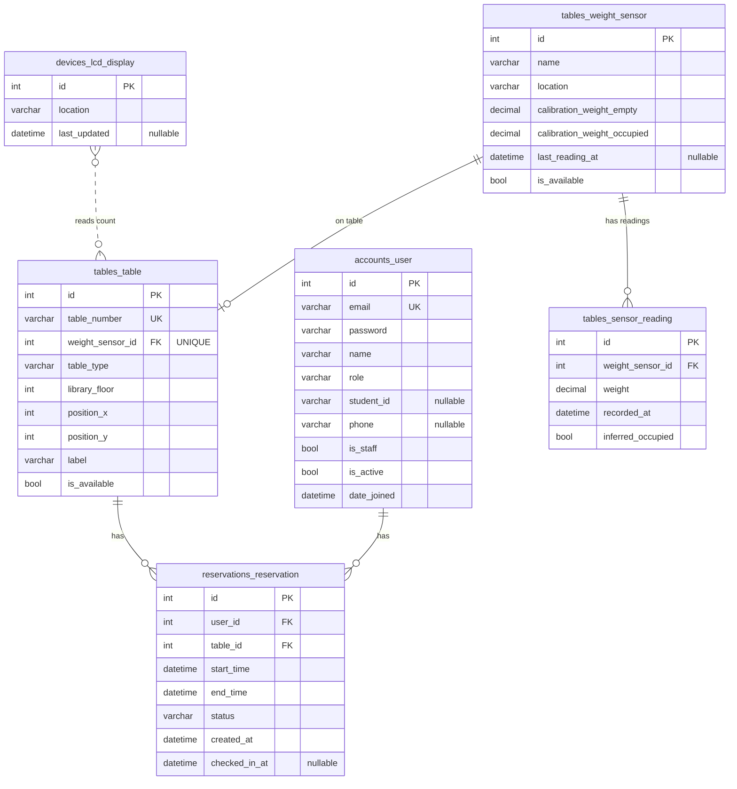
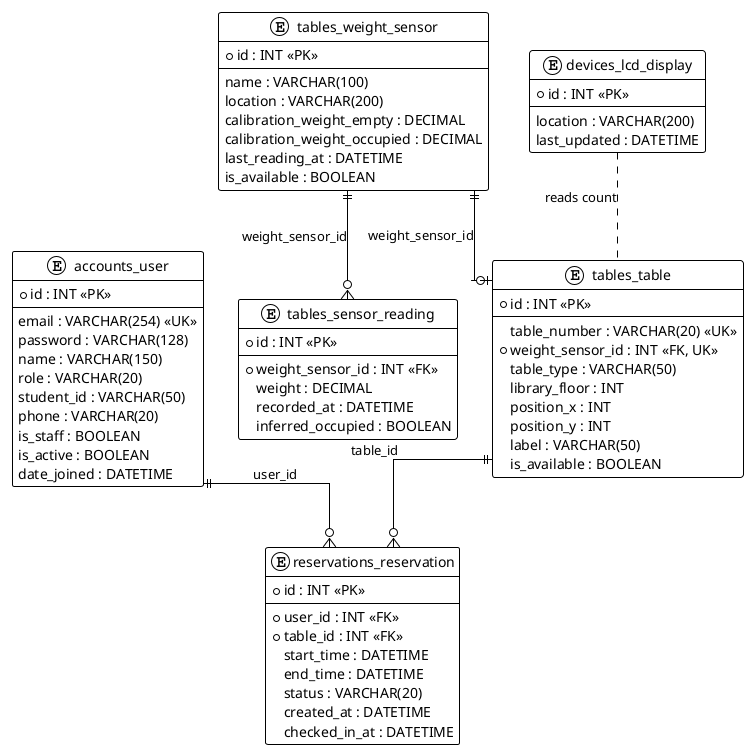

# Library Table Reservation System – ERD

---

## Mermaid ER diagram

---

## Table definitions (Django-style)

### 1. `accounts_user` (single auth table with role)

| Column       | Type         | Constraints     | Notes                                        |
|-------------|--------------|-----------------|----------------------------------------------|
| id          | INT          | PK, AUTO        |                                              |
| email       | VARCHAR(254) | UNIQUE, NOT NULL| Login identifier                             |
| password    | VARCHAR(128) | NOT NULL        | Hashed                                       |
| name        | VARCHAR(150) |                 | Full name                                    |
| role        | VARCHAR(20)  | NOT NULL        | STUDENT, STAFF, ADMIN (app role)             |
| student_id  | VARCHAR(50)  | NULL, UNIQUE    | e.g. matric number; only for role=STUDENT   |
| phone       | VARCHAR(20)  | NULL            |                                              |
| is_staff    | BOOLEAN      | DEFAULT FALSE   | Django admin site access                     |
| is_active   | BOOLEAN      | DEFAULT TRUE    |                                              |
| date_joined | DATETIME     | NOT NULL        |                                              |

*One table for all users; filter by `role` for students vs staff. Reservations link to `user_id` (students only in app logic).*

---

### 2. `tables_weight_sensor`

| Column                      | Type         | Constraints     | Notes                    |
|----------------------------|--------------|-----------------|--------------------------|
| id                         | INT          | PK, AUTO        | Use as sensor identifier |
| name                       | VARCHAR(100) |                 |                          |
| location                   | VARCHAR(200) |                 |                          |
| calibration_weight_empty   | DECIMAL(10,4)|                 | Weight = “table free”    |
| calibration_weight_occupied| DECIMAL(10,4)|                 | Weight = “occupied”      |
| last_reading_at             | DATETIME     | NULL            | Last update from device  |
| is_available                | BOOLEAN      | DEFAULT TRUE    | Derived from weight     |

---

### 4. `tables_sensor_reading`

| Column            | Type         | Constraints     | Notes (history for analytics) |
|-------------------|--------------|-----------------|--------------------------------|
| id                | INT          | PK, AUTO        |                                |
| weight_sensor_id  | INT          | FK → tables_weight_sensor.id, NOT NULL |     |
| weight            | DECIMAL(10,4)| NOT NULL        |                                |
| recorded_at       | DATETIME     | NOT NULL        |                                |
| inferred_occupied | BOOLEAN      | NOT NULL        | From calibration thresholds   |

*Index on (weight_sensor_id, recorded_at) for time-range and analytics queries.*

---

### 5. `tables_table`

| Column        | Type         | Constraints      | Notes                    |
|---------------|--------------|------------------|--------------------------|
| id            | INT          | PK, AUTO         |                          |
| table_number     | VARCHAR(20)  | UNIQUE, NOT NULL | e.g. "T01", "A-1"        |
| weight_sensor_id | INT          | FK → tables_weight_sensor.id, UNIQUE, NOT NULL | One sensor per table |
| table_type    | VARCHAR(50)  |                  | e.g. single, group, study |
| library_floor | INT          | NOT NULL         | Floor number (1, 2, …)   |
| position_x    | INT          | NOT NULL         | For library map layout   |
| position_y    | INT          | NOT NULL         | For library map layout   |
| label         | VARCHAR(50)  |                  | Display label            |
| is_available  | BOOLEAN      | DEFAULT TRUE     | Synced from sensor       |

---

### 6. `reservations_reservation`

| Column        | Type         | Constraints     | Notes                          |
|---------------|--------------|-----------------|--------------------------------|
| id            | INT          | PK, AUTO        |                                |
| user_id       | INT          | FK → accounts_user.id, NOT NULL | User who made reservation (typically role=STUDENT) |
| table_id      | INT          | FK → tables_table.id, NOT NULL |                        |
| start_time    | DATETIME     | NOT NULL        |                                |
| end_time      | DATETIME     | NOT NULL        |                                |
| status        | VARCHAR(20)  | NOT NULL        | PENDING, SUCCESS, DID_NOT_COME, CANCELLED, EXPIRED |
| created_at    | DATETIME     | NOT NULL        | When reservation was made      |
| checked_in_at | DATETIME     | NULL            | When user checked in (if any)   |

*Indexes: (user_id, created_at) for “my reservations”; (table_id, start_time, end_time) for availability checks.*

---

### 7. `devices_lcd_display`

| Column       | Type         | Constraints | Notes                    |
|--------------|--------------|-------------|--------------------------|
| id           | INT          | PK, AUTO    |                          |
| location     | VARCHAR(200) |             | Where the display is     |
| last_updated | DATETIME     | NULL        | Last time count refreshed|

---

## Relationship summary (cardinality)

| Parent table           | Child table               | Relationship | FK column    |
|------------------------|---------------------------|-------------|-------------|
| accounts_user          | reservations_reservation   | 1 : N       | reservation.user_id |
| tables_table           | reservations_reservation   | 1 : N       | reservation.table_id |
| tables_weight_sensor   | tables_table               | 1 : 1       | table.weight_sensor_id |
| tables_weight_sensor   | tables_sensor_reading      | 1 : N       | sensor_reading.weight_sensor_id |
| devices_lcd_display    | —                          | reads       | No FK; queries tables_table |

---

## How it fits your project

- **IoT:** `tables_weight_sensor` + `tables_sensor_reading` store calibration and history (sensor identified by PK); backend updates `last_reading_at` and `is_available` (and optionally appends a row to `tables_sensor_reading`).
- **Map & reservation:** `tables_table` has `position_x`, `position_y`, `table_number`, `label`, `is_available` for the web map and availability; `reservations_reservation` links users to tables and time slots.
- **Users:** Single `accounts_user` table with `role` (STUDENT, STAFF, ADMIN); students have `student_id`; staff use same table. Reservation history via `reservations_reservation` filtered by `user_id` (and role=STUDENT in app logic).
- **Admin:** Same tables support “all bookings”, “student list”, and analytics (e.g. popular table, busy hour/day) via aggregates on `reservations_reservation` and optionally `tables_sensor_reading`.
- **LCD:** Application or device service reads from `tables_table` (e.g. `COUNT(*) WHERE is_available = TRUE`) and optionally updates `devices_lcd_display.last_updated`.

This ERD is the database view of the system described in `CLASS_DIAGRAM.md`.
 
---

## PlantUML ERD (optional export)

Copy the block below into [PlantUML](https://www.plantuml.com/plantuml) or save as `ERD.puml` for PNG/SVG export.

-
